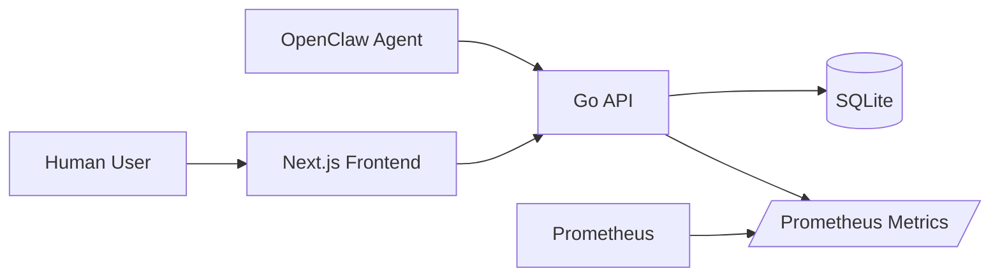
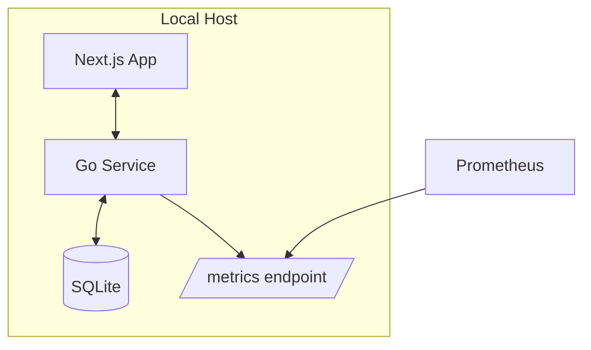
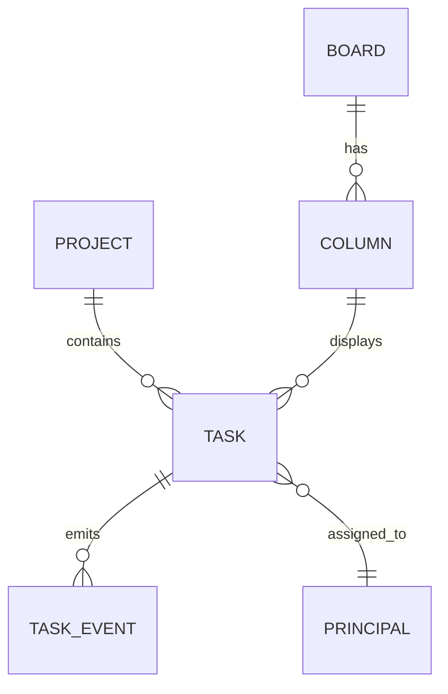
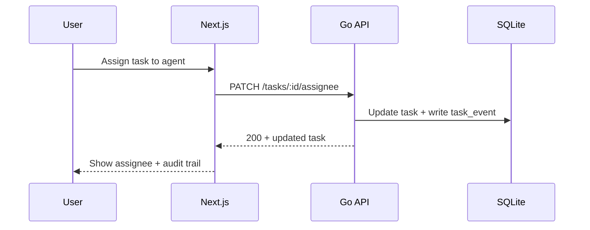

# Architecture Overview

## Goals
- Capture-first GTD workflow (Inbox -> Clarify -> Organize -> Reflect -> Engage)
- Kanban execution views by project/context/assignee
- Human + agent assignment with immutable activity log
- Local-first reliability and observability

## Context Diagram

## Container Diagram

## Core Components
- **Task Service**: task CRUD, GTD state transitions, recurrence
- **Project Service**: project ownership, lifecycle, WIP policy
- **Board Service**: kanban columns, swimlanes, ordering
- **Assignment Service**: human/agent principals, delegation, load checks
- **Audit Service**: append-only activity/event log
- **Review Service**: weekly review snapshots + stale detection

## Data Model (high-level)

## Sequence: assign task to agent

## Observability Artifacts
- Prometheus alert rules: `ops/prometheus/alerts.yml`
- Grafana dashboard: `ops/grafana/todo-app-observability.json`

## Using Observability Artifacts
1. Configure Prometheus to load `ops/prometheus/alerts.yml` and verify alert state for:
   - high weekly review failure ratio (15m, with minimum request-volume guard)
   - board lane fetch failures by `endpoint` over 10m
   - high weekly review p95 latency over 15m
2. Import `ops/grafana/todo-app-observability.json` in Grafana and map `DS_PROMETHEUS` to your Prometheus datasource.
3. Use the dashboard panels to confirm weekly review request/failure rates, failure ratio, p95 latency, and board lane failure spikes by endpoint.

## Architecture Delta (2026-03-03, autonomous loop)
- Added assignee-scoped deterministic Next selectors in `frontend/lib/app-store.ts`:
  1. `createAppStoreSnapshot(...)` now emits `nextTaskIdsByAssignee` keyed by principal id.
  2. Per-assignee ordering reuses the global deterministic comparator (`priority`, `dueAt`, `id`) to keep board focus views stable.
  3. Added regression coverage in `frontend/tests/app-store.test.ts` for grouped ordering output.
- Normalized paginated API responses to always return `items: []` (never `null`) for empty task queries; this removes frontend shape branching and hardens board/task lane rendering.
- Added regression coverage for empty inbox pagination payload shape.
- Added task intake metadata controls in the frontend create flow:
  1. `CreateTaskForm` now captures `priority` (1..5) and `dueAt` (`datetime-local`).
  2. `createTaskAction` validates and forwards `priority` + normalized `dueAt` ISO values to `/api/tasks`.
  3. Validation failures are surfaced with field-level errors for malformed priority/date input.
- Hardened mutation smoke workflow cleanup in `ops/run/check-task-mutations.sh` with an `EXIT` trap: if the script aborts mid-run, it still attempts to transition the synthetic task to `done`, preventing lingering `Next`-lane residue.
- Added ADR `docs/adr/0002-spa-routing-state-data.md` defining the SPA baseline for route split (`/board` default, `/tasks|projects|people|settings` extraction plan), normalized client cache, stale-while-revalidate data policy, and shared deterministic Next ordering comparator.
- Documented canonical Go binary fallback behavior for backend contract generation (`docs/backend-testing.md`): explicit `BACKEND_TEST_GO_BIN` override, Nix-path prepend, then `go` discovery from PATH with deterministic failure hints.

- Added deterministic subagent fanout planning utility: `ops/run/plan_subagent_fanout.py`.
  1. Sorts `Next` tasks by `priority`, then `dueAt`, then `id`.
  2. Selects a bounded batch (`--batch-size`, default 5) to respect worker caps/timeouts.
  3. Persists resume cursor in `.run/subagent-fanout-cursor.json` so multiple cycles eventually cover all `Next` tasks.
- Added unit coverage for ordering/cursor behavior in `ops/tests/test_subagent_fanout_planner.py`.
- Standardized Go binary resolution in `ops/run/generate-backend-contract-tests.sh`:
  1. Optional explicit `BACKEND_TEST_GO_BIN` (must be executable)
  2. `go` discovered on `PATH` after Nix profile bin candidates are prepended
  3. Hard failure with actionable hint when unresolved
- Contract test generation now executes with resolved `GO_BIN`, reducing non-interactive shell drift and making local/CI behavior deterministic.
- Integrated planner into runtime path via `ops/run/select_subagent_fanout_batch.py`:
  1. Fetches live `/api/tasks` across all pages.
  2. Optionally filters by `--project-id` (used for TODO App loop isolation).
  3. Exports fresh `.run/tasks.json` before selection.
  4. Invokes `ops/run/plan_subagent_fanout.py` to emit deterministic worker batch + persisted cursor.
- Added compact worker-spec emission in `ops/run/select_subagent_fanout_batch.py`:
  1. `--emit-spawn-spec` outputs ready-to-send `sessions_spawn` payloads.
  2. Worker prompts are intentionally short and task-scoped via `_build_worker_prompt(...)`.
  3. Default worker timeout is now explicitly tuned to `180s` (`--worker-timeout-seconds`) to reduce 60s timeout churn.
- Added full-sweep validation utility `ops/run/validate_subagent_fanout_sweep.py` to prove deterministic queue coverage:
  1. Replays `select_subagent_fanout_batch.py` across cycles until all current `Next` task IDs are seen or `--max-cycles` is hit.
  2. Writes machine-readable evidence to `.run/subagent-fanout-sweep-report.json` with coverage ratio and per-cycle cursor/selection details.
  3. Keeps worker spawning out-of-band, so planning validation is deterministic and testable without runtime side-effects.
- Added worker-outcome summary ingestion to the sweep validator:
  1. Reads `.run/subagent-worker-results.json` (or `--worker-results-json` override) when present.
  2. Emits `workerOutcomeSummary` with completion/timeout counts plus ratios.
  3. Provides unblock evidence for task #34 without coupling selection logic to spawn execution.

- Added board-first route split baseline for SPA IA:
  1. `frontend/app/page.tsx` now redirects root traffic to `/board`.
  2. `frontend/app/board/page.tsx` serves the existing dashboard implementation via `app/_dashboard.tsx`.
- Added drag-and-drop foundation metadata on board lane task cards:
  1. `TaskCard` now renders with `draggable` and task identity attributes (`data-task-id`, `data-task-state`).
  2. This enables follow-on client handlers for optimistic cross-column move interactions without changing server contracts yet.
  3. This keeps behavior stable while enabling future extraction of Tasks/Projects/People/Settings routes.
- Added regression coverage for board-first default routing in `frontend/tests/home-page-routing.test.tsx`, guarding against accidental root-route regressions away from `/board`.
- Strengthened frontend API envelope resilience tests in `frontend/tests/api-client.test.ts`:
  1. Verified paged fetch compatibility with nested `results.items` envelopes while preserving pagination metadata.
  2. Verified deterministic pagination derivation when APIs return bare arrays (legacy/mixed endpoint response modes).
- Added first board-first multi-page navigation slice:
  1. `frontend/app/layout.tsx` now exposes a persistent primary nav (`/board`, `/tasks`, `/projects`, `/people`, `/settings`).
  2. Stub route pages added for `/tasks`, `/projects`, `/people`, and `/settings` to support incremental extraction away from the monolithic dashboard page.
  3. Added `frontend/tests/tasks-page.test.tsx` to keep the new task route scaffold under regression coverage.
- Added inline board-lane task intake in `frontend/app/ui/board-lanes-section.tsx`:
  1. Each column now has an inline `Add` form for rapid capture directly in board context.
  2. Inline create maps lane names to GTD task states (`Inbox -> inbox`, `Next -> next`, `In Progress -> scheduled`, `Blocked -> waiting`, `Done -> done`).
  3. Inline create binds board column + project id so GTD constraints remain valid while reducing context switches.
- Added inline board-level column intake in `frontend/app/ui/board-lanes-section.tsx`:
  1. Each board shell now exposes an `Add column` form directly above lane columns.
  2. New column `position` auto-increments from the current max board column position (+10), with default `10` for empty boards.
  3. Added regression assertion in `frontend/tests/board-lanes-rendering.test.tsx` to keep board-lane column creation affordance present.
- Extended route-split extraction on `/projects`:
  1. `frontend/app/projects/page.tsx` now fetches real project data from `/api/projects` instead of static scaffold text.
  2. Added regression test `frontend/tests/projects-page.test.tsx` to lock API fetch contract + rendered project names.
- Added board focus defaults on `/board` route:
  1. `frontend/app/board/page.tsx` now injects default task filters when absent (`taskAssigneeId=2` for Samwise and active-state focus) before delegating to `_dashboard`.
  2. Added coverage in `frontend/tests/board-page-defaults.test.tsx` to prevent regressions in default/explicit filter handling.
- Completed `/board` focus-mode rendering hardening for multi-state defaults (`next,scheduled`):
  1. `frontend/app/_dashboard.tsx` now parses comma-separated `taskState` inputs into validated state arrays.
  2. Single-state filters still execute server-side; multi-state filters fall back to deterministic in-memory filtering of fetched task rows.
  3. Pagination UI now surfaces explicit focus-mode messaging when multi-state filters are active to avoid misleading page math.
- Added first inspector-panel slice for the board route (`task #13` increment):
  1. `frontend/lib/board-inspector.ts` computes board health counters from task state/assignee/due date.
  2. `frontend/app/_dashboard.tsx` now renders a `Board health` inspector panel immediately below board lanes.
  3. Added unit coverage in `frontend/tests/board-inspector.test.ts` for deterministic metric derivation.
- Extended inspector health metrics with a due-soon horizon (`task #13` follow-up increment):
  1. `frontend/lib/board-inspector.ts` now emits `dueSoonCount` for non-done tasks due within 24 hours.
  2. `frontend/app/_dashboard.tsx` now displays a `Due soon (24h)` badge alongside existing board-health counters.
  3. Added deterministic test coverage in `frontend/tests/board-inspector.test.ts` for due-soon window behavior.
- Expanded SPA migration roadmap contract in `docs/roadmap.md` (task #12):
  1. Broke Phase 2 into explicit implementation slices (route shell, shared state, SWR policy, modular extraction).
  2. Added concrete acceptance checks to keep route-split work measurable and regression-resistant.
- Added first unified client-store snapshot utility (`task #14` increment):
  1. `frontend/lib/app-store.ts` now builds normalized entity maps for tasks/boards/columns/principals.
  2. Utility exports deterministic `orderedNextTaskIds` ranked by `priority`, then `dueAt`, then `id`.
  3. Added coverage in `frontend/tests/app-store.test.ts` to guard ordering + indexing behavior.
- Implemented first offline-first read-cache slice (`task #15` increment):
  1. `frontend/lib/api-client.ts` now centralizes collection fetch policy with stale-while-revalidate defaults (`cache: force-cache`, `next.revalidate: 30`).
  2. Added explicit kill switch via `TODO_APP_SWR_SECONDS=0` to force `cache: no-store` during debugging or strict freshness runs.
  3. Added regression tests in `frontend/tests/api-client.test.ts` for default SWR behavior and the zero-second no-store fallback.
- Added explicit Phase-2 execution gates to roadmap (`task #12` atomic doc increment) so SPA migration progress can be assessed with binary pass/fail checks instead of narrative-only status updates.
- Upgraded `/settings` from placeholder scaffold to an actionable advanced-settings panel (`task #45` increment):
  1. Surfaces effective `TODO_APP_SWR_SECONDS` policy (including explicit `0 (no-store)` label).
  2. Documents board-first focus defaults used by the autonomous execution loop.
  3. Exposes current roadmap scope context so operators can sanity-check runtime posture in-app.
- Completed navigation clarity + quick-create affordance (`task #46` increment):
  1. Promoted top nav into `frontend/app/ui/top-nav.tsx` client component so active route highlighting can use `usePathname()`.
  2. Added explicit `aria-current="page"` + active styling (`.top-nav-link-active`) for orientation across `/board|/tasks|/projects|/people|/settings`.
  3. Added persistent `+ Quick create` nav action linking to `/board#quick-create-task`, and anchored board intake in `_dashboard` for direct jump-to-create.
  4. Added regression coverage in `frontend/tests/top-nav.test.tsx`.
- Autonomous loop checkpoint (2026-03-03 20:51 PT):
  1. Executed focused fanout checkpoint run (`validate_subagent_fanout_sweep.py --max-cycles 1`) to validate readiness for timeout-threshold decision task #52.
  2. Validation report showed no worker-outcome evidence source (`.run/subagent-worker-results.json` absent), so completion/timeout ratio remains undefined in current no-subagent mode.
  3. Moved #52 to Blocked and created #53 (`priority=1`) to acquire one outcome dataset via non-subagent path before resuming threshold decision.
- Autonomous loop increment (2026-03-03 21:21 PT):
  1. Added deterministic worker-outcome fixture fallback in `ops/run/validate_subagent_fanout_sweep.py` via `--worker-results-fixture-json` (default `ops/fixtures/subagent-worker-results.sample.json`).
  2. `workerOutcomeSummary` now reports `usedFixture` and `requestedPath` for explicit provenance when live worker output is absent.
  3. Added regression coverage in `ops/tests/test_validate_subagent_fanout_sweep.py` for fixture fallback behavior.
- Autonomous loop increment (2026-03-03 21:31 PT):
  1. Expanded `frontend/tests/top-nav.test.tsx` into parameterized coverage for non-board routes (`/tasks`, `/projects`, `/people`, `/settings`).
  2. Each route now asserts active-page semantics (`aria-current="page"`) while preserving persistent quick-create navigation (`/board#quick-create-task`).
- Autonomous loop increment (2026-03-03 23:38 PT):
  1. Hardened nav-route regression semantics in `frontend/tests/top-nav.test.tsx` to assert exactly one active link (`aria-current="page"`) per route render.
  2. Added explicit active-link matcher ensuring the `aria-current` marker is attached to the expected non-board route anchor.
- Autonomous loop increment (2026-03-03 22:01 PT):
  1. Completed TODO task #53 lifecycle transition (`Next -> In Progress -> Done`) in the app board while keeping `samwise` ownership.
  2. Hardened fanout sweep reporting for missing worker-outcome files: `workerOutcomeSummary` now keeps `requestedPath` even when neither live results nor fixture are present.
  3. Added focused regression coverage in `ops/tests/test_validate_subagent_fanout_sweep.py` for the missing-path provenance case.

### SLA Baseline (Task #51, 2026-03-03)
- API read latency SLOs: `GET /api/tasks` p50 <= 120ms, p95 <= 350ms under local benchmark load.
- Board render budget: initial `/board` contentful render <= 1.2s p50 and <= 2.0s p95 on warm cache.
- Interaction budget: lane move/create action feedback <= 150ms p50 and <= 300ms p95 (optimistic UI + server ack).
- Throughput target: sustain >= 40 task mutation requests/minute with <1% non-4xx failures.
- Regression gate: fail CI when measured p95 regresses >20% versus rolling 7-run median or absolute SLO ceiling is exceeded.

- Autonomous loop increment (2026-03-04 00:29 PT):
  1. Promoted offline-first cache guidance from a single stale-while-revalidate knob to explicit policy tiers (Hot/Warm/Cold datasets) in roadmap docs.
  2. Documented deterministic invalidation triggers (task mutation, board/column mutation, assignment changes) to keep local-first reads fast without stale-lane drift.
  3. Captured rollout order: ship read-cache tiering first, then mutation-triggered revalidation, then observability thresholds.

- Autonomous loop increment (2026-03-04 01:14 PT):
  1. Added `ops/run/benchmark_task_board.py` to measure local API read-path latency (`/api/tasks`, `/api/boards`, `/api/columns`) with p50/p95/avg/max summary output.
  2. Added focused percentile coverage in `ops/tests/test_benchmark_task_board.py` to keep SLO math deterministic.
- Autonomous loop increment (2026-03-04 02:01 PT):
  1. Extended `frontend/lib/api-client.ts` collection cache policy to select SWR TTL by endpoint tier (Hot: tasks/boards/columns, Warm: projects/principals, Cold: fallback endpoints).
  2. Added env controls `TODO_APP_SWR_HOT_SECONDS`, `TODO_APP_SWR_WARM_SECONDS`, `TODO_APP_SWR_COLD_SECONDS` with fallback to `TODO_APP_SWR_SECONDS` for deterministic rollout.
  3. Added regression coverage in `frontend/tests/api-client.test.ts` validating tier selection and per-endpoint revalidate values.
- Autonomous loop increment (2026-03-04 02:34 PT):
  1. Completed TODO task #16 lifecycle (`Next -> In Progress -> Done`) while maintaining `samwise` ownership in source-of-truth task state.
  2. Added benchmark SLA evaluation output to `ops/run/benchmark_task_board.py` (`result.sla.allPassed` + endpoint-level p95 target checks).
  3. Added focused regression coverage in `ops/tests/test_benchmark_task_board.py` for pass/fail SLA evaluation behavior.

## Architecture Delta (2026-03-04, autonomous loop)
- Board lane assembly now applies deterministic ordering for `Next` column cards (`priority`, `dueAt`, `id`) in `frontend/lib/board-lanes.ts`.
- Added focused regression coverage in `frontend/tests/board-lanes.test.ts` to lock `Next` ordering behavior.
- Extended backend benchmark harness (`ops/run/benchmark_task_board.py`) with repeatability metadata and throughput output:
  1. `run(...)` now accepts `delay_ms` pacing between requests to make benchmark pressure profiles explicit.
  2. Endpoint summaries include `throughput_rps` for quick capacity trend checks alongside latency percentiles.
  3. Output now includes `_meta` envelope with elapsed runtime and total request count for artifact comparability.
