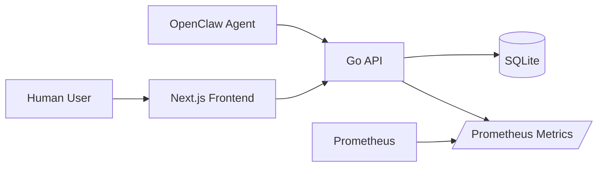
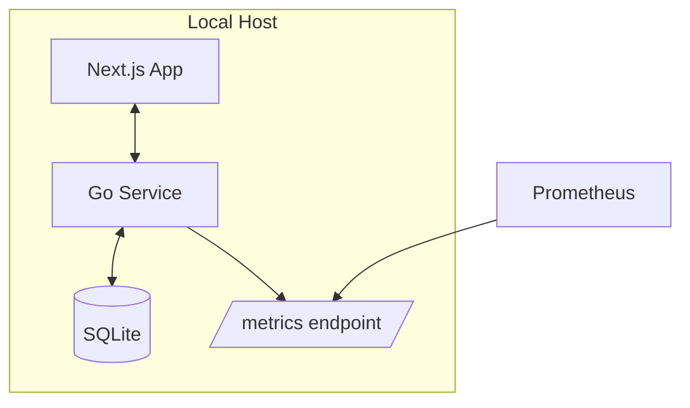
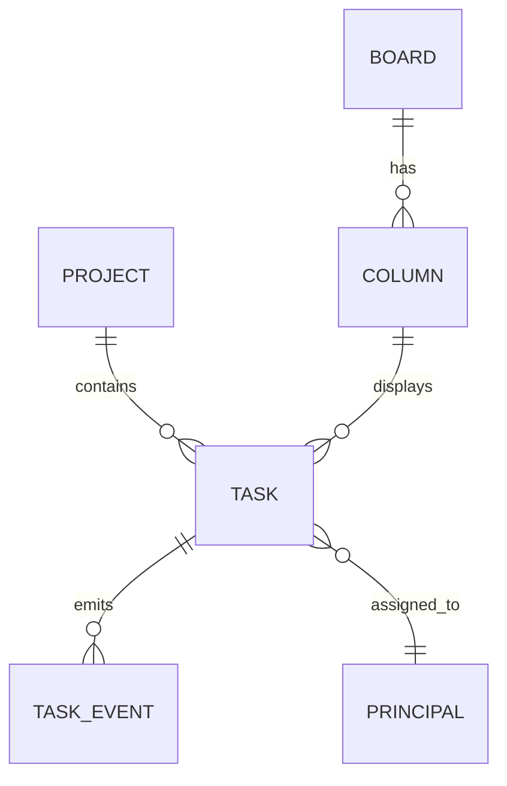
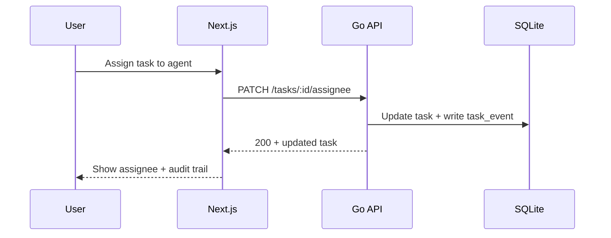

# Architecture Overview

## Goals
- Capture-first GTD workflow (Inbox -> Clarify -> Organize -> Reflect -> Engage)
- Kanban execution views by project/context/assignee
- Human + agent assignment with immutable activity log
- Local-first reliability and observability

## Context Diagram

## Container Diagram

## Core Components
- **Task Service**: task CRUD, GTD state transitions, recurrence
- **Project Service**: project ownership, lifecycle, WIP policy
- **Board Service**: kanban columns, swimlanes, ordering
- **Assignment Service**: human/agent principals, delegation, load checks
- **Audit Service**: append-only activity/event log
- **Review Service**: weekly review snapshots + stale detection

## Data Model (high-level)

## Sequence: assign task to agent

