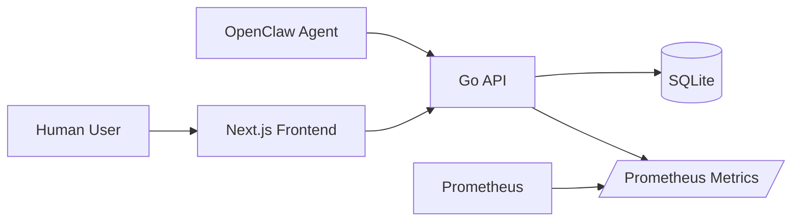
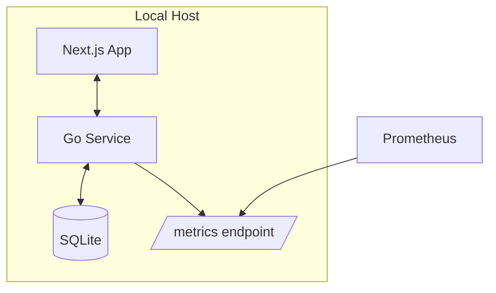
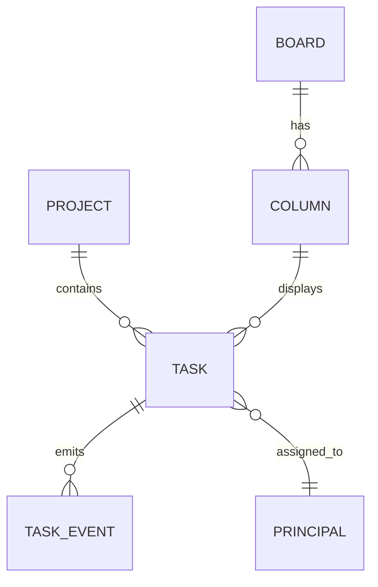
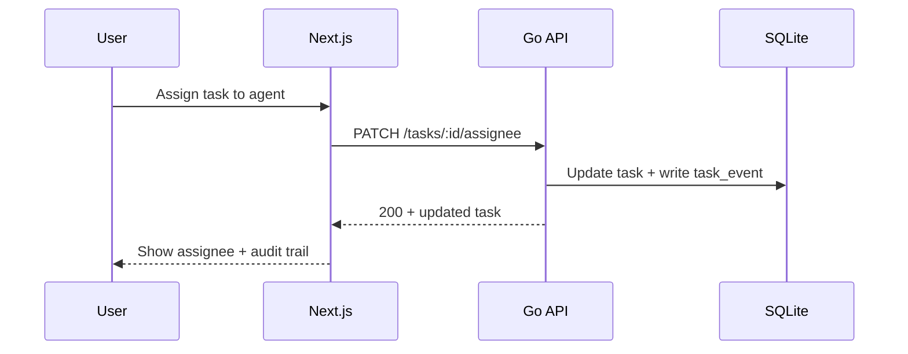

# Architecture Overview

## Goals
- Capture-first GTD workflow (Inbox -> Clarify -> Organize -> Reflect -> Engage)
- Kanban execution views by project/context/assignee
- Human + agent assignment with immutable activity log
- Local-first reliability and observability

## Context Diagram

## Container Diagram

## Core Components
- **Task Service**: task CRUD, GTD state transitions, recurrence
- **Project Service**: project ownership, lifecycle, WIP policy
- **Board Service**: kanban columns, swimlanes, ordering
- **Assignment Service**: human/agent principals, delegation, load checks
- **Audit Service**: append-only activity/event log
- **Review Service**: weekly review snapshots + stale detection

## Data Model (high-level)

## Sequence: assign task to agent

## Observability Artifacts
- Prometheus alert rules: `ops/prometheus/alerts.yml`
- Grafana dashboard: `ops/grafana/todo-app-observability.json`

## Using Observability Artifacts
1. Configure Prometheus to load `ops/prometheus/alerts.yml` and verify alert state for:
   - high weekly review failure ratio (15m, with minimum request-volume guard)
   - board lane fetch failures by `endpoint` over 10m
   - high weekly review p95 latency over 15m
2. Import `ops/grafana/todo-app-observability.json` in Grafana and map `DS_PROMETHEUS` to your Prometheus datasource.
3. Use the dashboard panels to confirm weekly review request/failure rates, failure ratio, p95 latency, and board lane failure spikes by endpoint.

## Architecture Delta (2026-03-03, autonomous loop)
- Normalized paginated API responses to always return `items: []` (never `null`) for empty task queries; this removes frontend shape branching and hardens board/task lane rendering.
- Added regression coverage for empty inbox pagination payload shape.
- Added task intake metadata controls in the frontend create flow:
  1. `CreateTaskForm` now captures `priority` (1..5) and `dueAt` (`datetime-local`).
  2. `createTaskAction` validates and forwards `priority` + normalized `dueAt` ISO values to `/api/tasks`.
  3. Validation failures are surfaced with field-level errors for malformed priority/date input.
- Hardened mutation smoke workflow cleanup in `ops/run/check-task-mutations.sh` with an `EXIT` trap: if the script aborts mid-run, it still attempts to transition the synthetic task to `done`, preventing lingering `Next`-lane residue.
- Added ADR `docs/adr/0002-spa-routing-state-data.md` defining the SPA baseline for route split (`/board` default, `/tasks|projects|people|settings` extraction plan), normalized client cache, stale-while-revalidate data policy, and shared deterministic Next ordering comparator.
- Documented canonical Go binary fallback behavior for backend contract generation (`docs/backend-testing.md`): explicit `BACKEND_TEST_GO_BIN` override, Nix-path prepend, then `go` discovery from PATH with deterministic failure hints.

- Added deterministic subagent fanout planning utility: `ops/run/plan_subagent_fanout.py`.
  1. Sorts `Next` tasks by `priority`, then `dueAt`, then `id`.
  2. Selects a bounded batch (`--batch-size`, default 5) to respect worker caps/timeouts.
  3. Persists resume cursor in `.run/subagent-fanout-cursor.json` so multiple cycles eventually cover all `Next` tasks.
- Added unit coverage for ordering/cursor behavior in `ops/tests/test_subagent_fanout_planner.py`.
- Standardized Go binary resolution in `ops/run/generate-backend-contract-tests.sh`:
  1. Optional explicit `BACKEND_TEST_GO_BIN` (must be executable)
  2. `go` discovered on `PATH` after Nix profile bin candidates are prepended
  3. Hard failure with actionable hint when unresolved
- Contract test generation now executes with resolved `GO_BIN`, reducing non-interactive shell drift and making local/CI behavior deterministic.
- Integrated planner into runtime path via `ops/run/select_subagent_fanout_batch.py`:
  1. Fetches live `/api/tasks` across all pages.
  2. Optionally filters by `--project-id` (used for TODO App loop isolation).
  3. Exports fresh `.run/tasks.json` before selection.
  4. Invokes `ops/run/plan_subagent_fanout.py` to emit deterministic worker batch + persisted cursor.
- Added compact worker-spec emission in `ops/run/select_subagent_fanout_batch.py`:
  1. `--emit-spawn-spec` outputs ready-to-send `sessions_spawn` payloads.
  2. Worker prompts are intentionally short and task-scoped via `_build_worker_prompt(...)`.
  3. Default worker timeout is now explicitly tuned to `180s` (`--worker-timeout-seconds`) to reduce 60s timeout churn.
- Added full-sweep validation utility `ops/run/validate_subagent_fanout_sweep.py` to prove deterministic queue coverage:
  1. Replays `select_subagent_fanout_batch.py` across cycles until all current `Next` task IDs are seen or `--max-cycles` is hit.
  2. Writes machine-readable evidence to `.run/subagent-fanout-sweep-report.json` with coverage ratio and per-cycle cursor/selection details.
  3. Keeps worker spawning out-of-band, so planning validation is deterministic and testable without runtime side-effects.
- Added worker-outcome summary ingestion to the sweep validator:
  1. Reads `.run/subagent-worker-results.json` (or `--worker-results-json` override) when present.
  2. Emits `workerOutcomeSummary` with completion/timeout counts plus ratios.
  3. Provides unblock evidence for task #34 without coupling selection logic to spawn execution.

- Added board-first route split baseline for SPA IA:
  1. `frontend/app/page.tsx` now redirects root traffic to `/board`.
  2. `frontend/app/board/page.tsx` serves the existing dashboard implementation via `app/_dashboard.tsx`.
  3. This keeps behavior stable while enabling future extraction of Tasks/Projects/People/Settings routes.
- Added regression coverage for board-first default routing in `frontend/tests/home-page-routing.test.tsx`, guarding against accidental root-route regressions away from `/board`.
- Strengthened frontend API envelope resilience tests in `frontend/tests/api-client.test.ts`:
  1. Verified paged fetch compatibility with nested `results.items` envelopes while preserving pagination metadata.
  2. Verified deterministic pagination derivation when APIs return bare arrays (legacy/mixed endpoint response modes).
- Added first board-first multi-page navigation slice:
  1. `frontend/app/layout.tsx` now exposes a persistent primary nav (`/board`, `/tasks`, `/projects`, `/people`, `/settings`).
  2. Stub route pages added for `/tasks`, `/projects`, `/people`, and `/settings` to support incremental extraction away from the monolithic dashboard page.
  3. Added `frontend/tests/tasks-page.test.tsx` to keep the new task route scaffold under regression coverage.
- Added inline board-lane task intake in `frontend/app/ui/board-lanes-section.tsx`:
  1. Each column now has an inline `Add` form for rapid capture directly in board context.
  2. Inline create maps lane names to GTD task states (`Inbox -> inbox`, `Next -> next`, `In Progress -> scheduled`, `Blocked -> waiting`, `Done -> done`).
  3. Inline create binds board column + project id so GTD constraints remain valid while reducing context switches.
- Extended route-split extraction on `/projects`:
  1. `frontend/app/projects/page.tsx` now fetches real project data from `/api/projects` instead of static scaffold text.
  2. Added regression test `frontend/tests/projects-page.test.tsx` to lock API fetch contract + rendered project names.
- Added board focus defaults on `/board` route:
  1. `frontend/app/board/page.tsx` now injects default task filters when absent (`taskAssigneeId=2` for Samwise and active-state focus) before delegating to `_dashboard`.
  2. Added coverage in `frontend/tests/board-page-defaults.test.tsx` to prevent regressions in default/explicit filter handling.
- Added first inspector-panel slice for the board route (`task #13` increment):
  1. `frontend/lib/board-inspector.ts` computes board health counters from task state/assignee/due date.
  2. `frontend/app/_dashboard.tsx` now renders a `Board health` inspector panel immediately below board lanes.
  3. Added unit coverage in `frontend/tests/board-inspector.test.ts` for deterministic metric derivation.
- Expanded SPA migration roadmap contract in `docs/roadmap.md` (task #12):
  1. Broke Phase 2 into explicit implementation slices (route shell, shared state, SWR policy, modular extraction).
  2. Added concrete acceptance checks to keep route-split work measurable and regression-resistant.
- Added first unified client-store snapshot utility (`task #14` increment):
  1. `frontend/lib/app-store.ts` now builds normalized entity maps for tasks/boards/columns/principals.
  2. Utility exports deterministic `orderedNextTaskIds` ranked by `priority`, then `dueAt`, then `id`.
  3. Added coverage in `frontend/tests/app-store.test.ts` to guard ordering + indexing behavior.
- Implemented first offline-first read-cache slice (`task #15` increment):
  1. `frontend/lib/api-client.ts` now centralizes collection fetch policy with stale-while-revalidate defaults (`cache: force-cache`, `next.revalidate: 30`).
  2. Added explicit kill switch via `TODO_APP_SWR_SECONDS=0` to force `cache: no-store` during debugging or strict freshness runs.
  3. Added regression tests in `frontend/tests/api-client.test.ts` for default SWR behavior and the zero-second no-store fallback.
